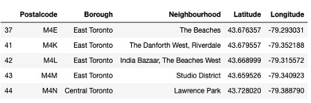
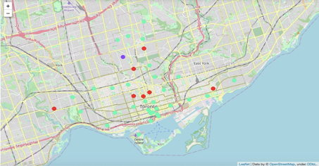

# [IBM Data Science Professional Capstone Project Repository](https://github.com/ritchatterjee/Battle-of-the-Neighbourhoods) 

This repository, and all the files contained within it, makes up my final Assignment for the Capstone Project for IBM's Applied Data Science Professional. This is my final module in the IBM Data Science Professional Certificate programme.

# Project: Battle of the Neighborhoods - Overview
 
* Created a tool that identifies suitable locations for a certain type of retaurant based on its relative frequency in its surrounding neighborhood
 
* Scraped neighborhood, location and venue data various online datasets (IBM and Foursquare)
 
* Cleaned and Contextualized the data with a pandas dataframe to be fed into a K-means clustering algorithm to give data-driven insights
 
* Presented a usecase for this tool in the form of a [proposal](https://github.com/ritchatterjee/Battle-of-the-Neighbourhoods/blob/master/Capstone%20final.pdf) to solve a specific business need for a client. 

